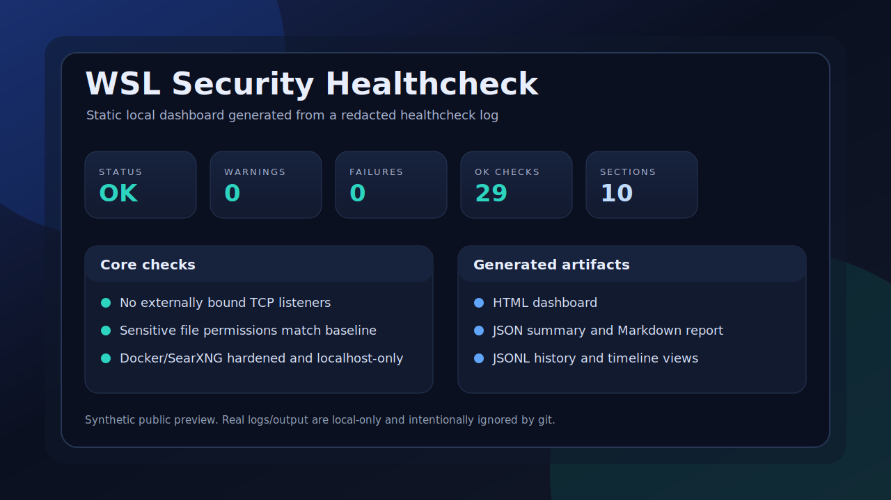

# System Healthcheck

A local-first WSL/Linux workstation healthcheck for automation engineers. It validates host readiness, exposed services, Docker container hardening, sensitive-file permissions, and optional Hermes Agent smoke checks, then renders static HTML, Markdown, JSON, and history timeline artifacts.

This project is intentionally dependency-light: the shell healthcheck uses common Linux CLI tools, and the report renderers use only the Python standard library.

## What this demonstrates

- Practical workstation security/readiness automation
- WSL/Linux service and listener inspection
- Docker exposure and hardening checks
- Secret-safe permission auditing without reading secret contents
- Static dashboard/report generation from redacted logs
- Cron/watchdog-friendly output patterns
- Standard-library Python parsing, rendering, and tests

## Features

- Detects host/WSL context and required commands
- Reports pending apt upgrades
- Checks failed systemd and user systemd units
- Lists TCP listeners and warns on externally bound services
- Validates expected local services such as Caddy, SSH, Docker, and Hermes gateway when present
- Runs localhost HTTP smoke checks for local services
- Inspects Docker/SearXNG exposure and hardening metadata
- Checks sensitive file permissions without reading secret file contents
- Runs Hermes doctor/provider smoke tests when Hermes is installed
- Produces:
  - terminal healthcheck output
  - standalone HTML dashboard
  - compact JSON summary
  - pasteable Markdown report
  - append-only JSONL history
  - Markdown/HTML history timeline

## Demo preview



The preview above is synthetic and safe for public display. Real `logs/` and `output/` artifacts are generated locally and intentionally ignored by git because they can include hostnames, usernames, paths, service names, and package details.

## Project structure

```text
.
├── assets/
│   └── dashboard-preview.svg    # Synthetic public dashboard preview
├── security_check.sh            # Main non-destructive healthcheck
├── tools/
│   ├── render_dashboard.py      # HTML/JSON/Markdown renderer for latest log
│   └── render_history.py        # Markdown/HTML timeline renderer for JSONL history
├── tests/
│   ├── test_render_dashboard.py
│   └── test_render_history.py
├── Makefile                     # Convenience targets
├── index.md                     # Local artifact index
└── .github/workflows/ci.yml     # GitHub Actions validation
```

Generated runtime artifacts are intentionally ignored by git:

```text
logs/
output/
```

## Requirements

Core runtime:

- Bash
- Python 3.10+
- Common Linux commands: `ss`, `systemctl`, `curl`, `stat`

Optional checks use these commands only when available:

- `docker`
- `apt`
- `hermes`

No third-party Python packages are required.

## Setup

Clone the repository and enter the project directory:

```bash
git clone https://github.com/NPFernando/system-healthcheck.git
cd system-healthcheck
```

Run the unit tests:

```bash
PYTHONPATH=. python3 -m unittest discover -s tests -v
```

## Usage

Run the main healthcheck:

```bash
bash security_check.sh
```

Exit codes:

- `0`: OK
- `1`: warnings found
- `2`: failures found

Use the Makefile from the project directory:

```bash
make check      # run healthcheck
make test       # run unit tests
make dashboard  # render output/dashboard.html from logs/latest.log
make summary    # render output/summary.json from logs/latest.log
make report     # render output/report.md from logs/latest.log
make history    # append one compact record to output/history.jsonl
make timeline   # render output/history.md and output/history.html
make all        # test + check + dashboard + summary + report + history + timeline
```

For a one-shot local run that captures a log and renders artifacts:

```bash
mkdir -p logs output
bash security_check.sh | tee logs/latest.log
python3 tools/render_dashboard.py --input logs/latest.log --output output/dashboard.html
python3 tools/render_dashboard.py --input logs/latest.log --json-output output/summary.json --no-html
python3 tools/render_dashboard.py --input logs/latest.log --markdown-output output/report.md --no-html
python3 tools/render_dashboard.py --input logs/latest.log --append-history output/history.jsonl --no-html
python3 tools/render_history.py --input output/history.jsonl --markdown-output output/history.md --html-output output/history.html
```

## Example baseline

The checker can be tuned by editing `security_check.sh`. The current local-first baseline expects common development services to bind to localhost only, for example:

- SSH on `127.0.0.1:22` / `[::1]:22`
- Caddy on `127.0.0.1:80`
- SearXNG on `127.0.0.1:8080`
- Ollama on `127.0.0.1:11434`
- Caddy admin on `127.0.0.1:2019`

For the optional SearXNG Docker check, the baseline is:

- Published only to localhost
- `Privileged=false`
- `cap_drop: [ALL]`
- `security_opt: [no-new-privileges:true]`

## Security notes

- The healthcheck is non-destructive.
- It does not read or print secret file contents.
- Output is passed through a redaction helper before printing sensitive-looking values.
- Real runtime logs can still reveal local usernames, hostnames, service names, paths, and installed package names. Do not commit generated `logs/` or `output/` artifacts unless reviewed.
- Keep `.env`, private keys, auth files, and generated logs out of git.

## Validation

Run the automated tests:

```bash
make test
```

Run the healthcheck and renderers:

```bash
mkdir -p logs output
bash security_check.sh | tee logs/latest.log
python3 tools/render_dashboard.py --input logs/latest.log --output output/dashboard.html --json-output output/summary.json --markdown-output output/report.md
python3 tools/render_dashboard.py --input logs/latest.log --append-history output/history.jsonl --no-html
python3 tools/render_history.py --input output/history.jsonl --markdown-output output/history.md --html-output output/history.html
```

## Roadmap

- Add configurable baselines via a sample config file
- Add machine-readable severity metadata per check
- Add optional SARIF or GitHub Step Summary output
- Add screenshot examples for dashboard artifacts
- Package as a portable CLI wrapper

## License

MIT
